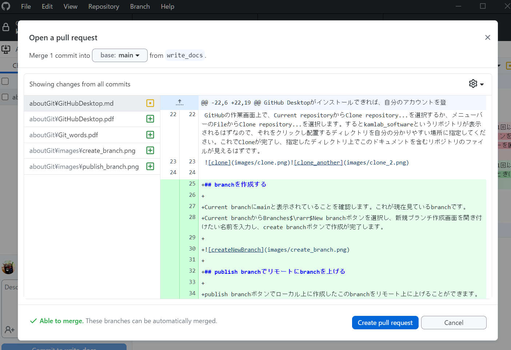

# GitHub Desktopを使ってGitを利用する

GitHub Desktopとは、Gitの機能をGUI(クリック操作など)で利用するためのアプリです。  
CLI操作を説明するよりもGUIの操作のほうが簡単だと思ったので今回はこちらを紹介します  

(CLIが好きな方はそちらを使っていただいて大丈夫です)

## GitHub Desktopをインストールする

次のサイトから、各自使用しているOSに合わせてインストーラをダウンロードしてください。  

[GitHub-Desktop](https://desktop.github.com/)  

ダウンロードしたら起動して、インストールを開始します。細かなオプションはすべてデフォルトで大丈夫です。(こだわりがあれば各自変更してください)  

## アカウントを登録する

GitHub Desktopがインストールできれば、自分のアカウントを登録するよう促されるので登録してください。この登録がされていない場合、Private(一般に非公開)設定されているリポジトリが見えません

## リポジトリをCloneする

GitHubの作業画面上で、Current repositoryからClone repository...を選択するか、メニューバーのFileからClone repository...を選択します。するとkamlab_softwareというリポジトリが表示されるはずなので、それをクリックし配置するディレクトリを自分の分かりやすい場所に指定してください。これでCloneが完了し、指定したディレクトリ上でこのドキュメントを含むリポジトリのファイルが見えるはずです。

## branchを作成する

Current branchにmainと表示されていることを確認します。これが現在見ているbranchです。  
Current branchからBranches$\rarr$New branchボタンを選択し、新規ブランチ作成画面を開き付けたい名前を入力し、create branchボタンで作成が完了します。  

## publish branchでリモートにbranchを上げる

publish branchボタンでローカル上に作成したこのbranchをリモート上に上げることができます。

## 作業する(ファイル編集)

cloneして作ったディレクトリ内で、いつものように作業を行ってください。VSCodeがGitHubとの連携が楽でおすすめですが、テキストエディタでも特に問題はありません。ファイルの追加などもいつも通り行えます。

## commitする

ファイルを変更したら、ローカルリポジトリに反映するためcommitします。  
GitHub desktopでは変更したファイルが画面左側に次のように表示されているはずなので、変更を反映したいファイルのチェックボックスにチェックを入れて、コミットの概要と説明を下段のテキストボックスに書き込みます(説明は無くても大丈夫ではありますが、どんな変更かを書いておくほうがgoodです)  
Commit to **main**のボタンを押せば完了です。  

GitHub desktopではstageを経由せずcommitできます。(というより、チェックボックスがstage代わり?)

## pushする

commitすれば画面にpushのオプションが表示されるはずなので、単純にボタンを押せばpush完了です。(conflictがない限り)  

## pull requestを出す

**そのブランチでの作業が完了してからこの操作を行ってください。** branchで作業をしているとき、pushを1回以上行うとGitHub desktopの作業画面にpreview pull requestというボタンが表示されます。本流に変更を反映したいときはまずこのボタンを押してください。あるいはメニューバーからBranch$\rarr$Preview pull requestでも開けます。これでpull reqを出す対象のbranchと比較したときどのような変更が加わるのかを確認できます。  

左上がMerge [n] commit into [対象のbranch] from [現在のbranch]となっています。mainに対して変更を反映したいのでこのような表示です。  
左下にはAble to mergeという表示があります。特に問題なくmerge出来そうなのでCreate pull requestボタンを押せばmainに対してpull requestが作成できます(ブラウザでGitHubが開くので、説明などを記入してください)

あとはMerge pull requestが通れば反映されます。以上で一通りの作業が完了します。

## fetchについて

GitHub desktopの作業画面上でfetch originを押すとリモートリポジトリの状態を取得し、ローカルとの差があればそれを知らせてpullのオプションを出してくれます。pullすればリモートの状態をローカルに持ってくることができます。

